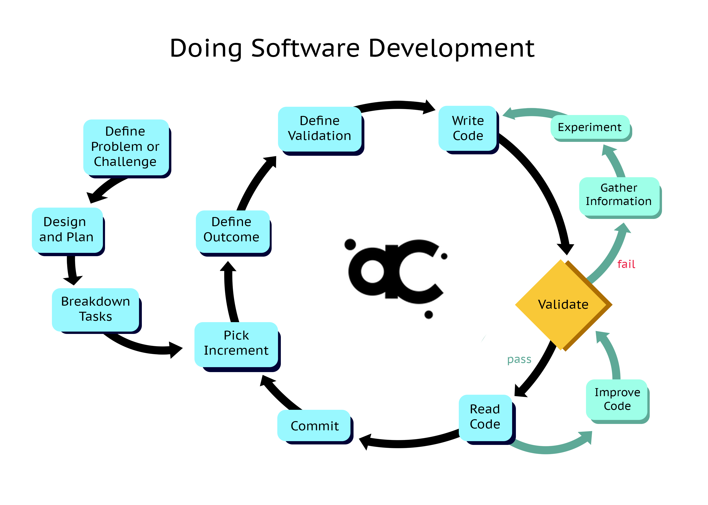

# Bootcamp 2

## Developer Focus

### Design (Technical & Product)

Upfront planning to figure out problem _before_ coding

### Balance

1. Practice to grow: `competent` --> `proficient` --> `fluent`
1. Know how to progress when you don't know

### Skills

1. Analyze
1. Synthesize
1. Integrate

### Diagnose Problems

Improve ability to solve problems, and/or get effective help

1. Speak in terms of expected vs actual
    1. What are you trying to accomplish? 
    1. What is goal?
    1. What step are you on?
2. Feedback Discovered
    1. What have you noticed so far?
    1. What have you tried?
    1. What has or has not worked?
3. Avoid these types of explaining:
    1. Pleading Your Case
    1. Memoirs and Histories

## Class

### Readings

More readings, try and keep up!

First week is heaviest.

### Code Challenges

There are daily code challenges:

1. Work on these starting end of class
1. Collaborative start, individual finish
1. Try and be complete by next morning
1. (Don't start paired labs till morning)
1. Final submissions due before start of project week

### Warm Ups

1. 15 minute challenges + discussion at start of class
1. Involves guessing as to what code might do
1. Includes other languages
1. Not graded

### Retros

In lieu of journal assignments, you will have a daily "retro" to complete.