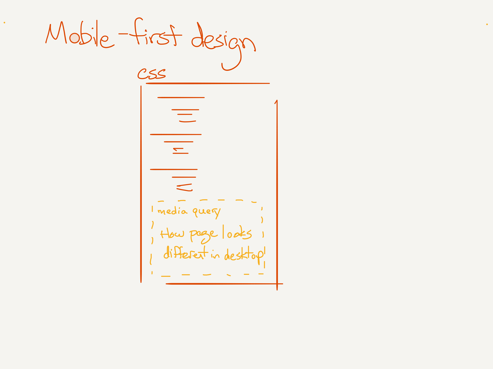

Class 03: RWD and fetch/Promises
===

- Design for multiple devices like mobile and desktop
- Use `fetch` to request data from a server using JS

## Agenda

- Warm Up
- RWD
- Project Folders
- fetch/async
- Code Challenge 

## Warm Up

[Exercise](./warm-up.md)

## RWD

### Mobile First

Easier to go from simple to more complex.



**Demo: Chrome Mobile Emulator**

### Responsive Web Design

Adapt the layout to the device, versus having separate layouts (m.company.com)

How?

- Layout (Grid and Flex Box)
- Media Queries
- Both
- css: `%`, `calc`

Try and solve in simplest way

### Media Query

Media queries allow us to selectively apply css based on 
device characteristics

```css

@media (min-width:481px) and (max-width:959px) {
  body {
    width:768px;
  }
}

@media (min-width:960px) {
  body {
    width:960px;
  }
}

```

Also: 

- `screen` vs `print`
- pointer media queries

## Project Folders

Organize with folders:

- src
    - components
        - app
            - App.js
            - App.css
            - Header.css
            - Header.js
        - options
            - ...
        - pokedex
            - ...
        - Component.js
            - ...
    - main.css
    - reset.css
    - index.js

## Code Challenge

`03-sort`

