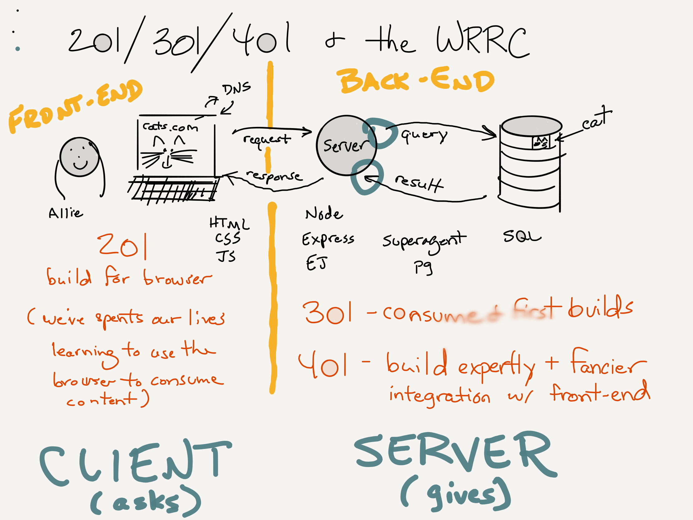

Class 03: RWD and fetch/Promises
===

- Design for multiple devices like mobile and desktop
- Use `fetch` to request data from a server using JS

## Agenda

1. Warm Up
1. RWD
1. Project Folders
1. fetch/async
1. Distributed Systems
1. Async JavaScript
1. Promises
1. Using `fetch` for Data
1. Code Challenge 

## Warm Up

[Exercise](./warm-up.md)

## RWD

### Mobile First

Easier to go from simple to more complex.


**Demo: Chrome Mobile Emulator**

### Responsive Web Design

Adapt the layout to the device, versus having separate layouts (m.company.com)

How?

- Layout (Grid and Flex Box)
- Media Queries
- Both
- css: `%`, `calc`

Try and solve in simplest way

### Media Query

Media queries allow us to selectively apply css based on 
device characteristics.

```css

@media (min-width:481px) and (max-width:959px) {
  body {
    width:768px;
  }
}

@media (min-width:960px) {
  body {
    width:960px;
  }
}

Media query is **more specific** than without

```

Also: 

- `screen` vs `print`
- pointer media queries

## Project Folders

Organize with folders:

- src
    - components
        - app
            - App.js
            - App.css
            - Header.css
            - Header.js
        - options
            - ...
        - pokedex
            - ...
        - Component.js
            - ...
    - main.css
    - reset.css
    - index.js


Use the `fetch` browser command and JavaScript Promises

## Distributed Systems

Application span multiple computers, and can include:

1. User's device (mobile or desktop browser)
1. Servers you write
1. Database servers you run
1. Other people's servers you access

### Web Request Response Cycle



## Asynchronous JavaScript

The JavaScript code you write may run at different times. This will
**always** be at a function level.

Functions are how we specify units of work, some of which may execute at
a later time and _may_ execute multiple times.

[Three JS Function Passing Patters](three-js-functional-patterns.md)

## Promises

Promises extend the capabilities of callbacks by to better handle
sequential and parallel workflows. Instead of passing a callback
function, the promise is an object that offers a `.then` method
for registering the callback.

* `.then` method calls can be chained for sequential workflows.
* `.catch` can be used to register a callback for errors

## Using `fetch` for Data (Promises in Action)

The `fetch` command offers a promise-based interface. We use a stepped
sequence:

1. Initiate fetch
1. First `then` will be called when complete, use the build-it `response.json()` method to extract the data
1. The actual data from the json will be passed to the second `then`
1. Any error that happens during the process will surface in the `catch`

```js

const URL = 'https://ghibliapi.herokuapp.com/films';

fetch(URL)
    .then(response => response.json())
    .then(films => {
        loadFilms(films);
    })
    .catch(err => {
        console.error('fetch error:', err);
    });

```

## Code Challenge

`03-sort`

