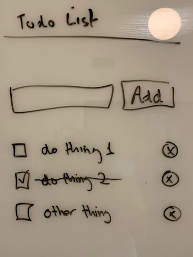

LAB 11: Fullstack TODO list
===

## Goal

Create an app with a single page for tracking TODOs

1. Display a list of todos and indicate whether or not complete
1. Have a form for adding a todo
1. Mark a todo as complete
1. STRETCH: Remove a todo

## Project

Use the same project structure as for the prior lab, a single repository with the app in the `public` folder.

**Work in vertical slices!**

## Todo

```js
{
    task: 'Thing to do',
    completed: false
}
```

## App


1. Only one html page required, all of the work will happen on this page!
1. All of the data work will happen in the `App` component
1. For adding or removing data, don't refresh the list of todos from the server, instead:
    1. add, update, or remove the todo using a server method
    1. on success, modify the array you already have (add, replace, or remove to/from array of todos)
    1. call update on the list component with the updated array

### Components



- `App`
    - `AddTodo` (props: `onAdd`)
    - `TodoList` (props: `todos`, `onUpdate`[, `onRemove`])
        - [`TodoItem`] (props: `todo`, `onUpdate`[, `onRemove`])
    
**Draw both a boxed UI component diagram and a tree-flow diagram and submit a photo with your lab**

### API Services

1. `getTodos()`
1. `addTodo(todo)`
1. `updateTodo(todo)`
1. [`removeTodo(todoId)`]

## Server 

Route | SQL
---|---
`GET /todos` | `SELECT`
`POST /todos` | `INSERT` w/ `RETURNING`
`PUT /todos/:id` | `UPDATE` w/ `RETURNING`
STRETCH: `DELETE /todos/:id` `DELETE`

## Points Break Down

Looking For | Points (10)
:--|--:
Component UI Diagram and Data Flow Diagram | 2
Vertical: Add a Todo | 2
Vertical: Get Todos | 3
Vertical: Mark Todo Complete | 3
Vertical: Remove Todo | +2
